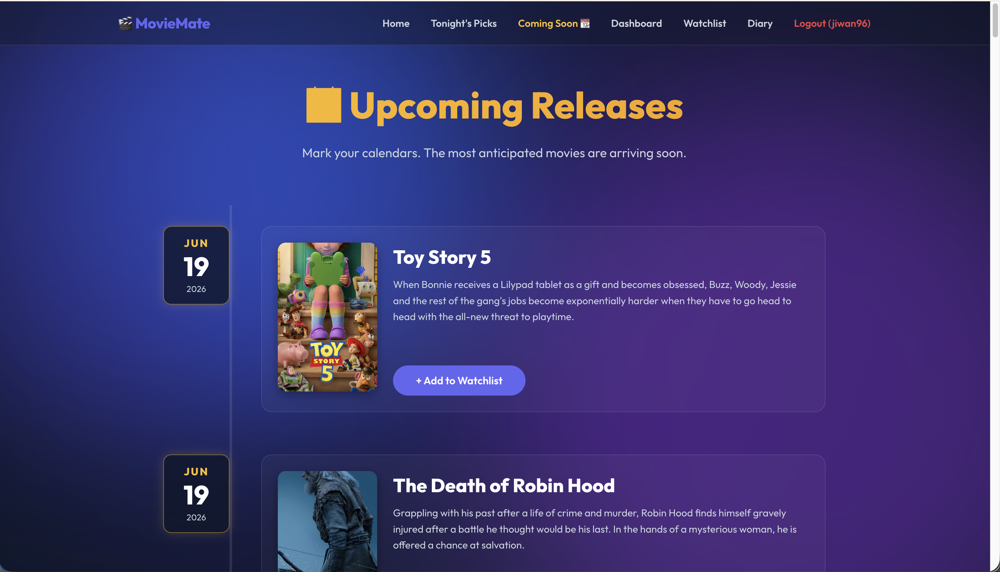
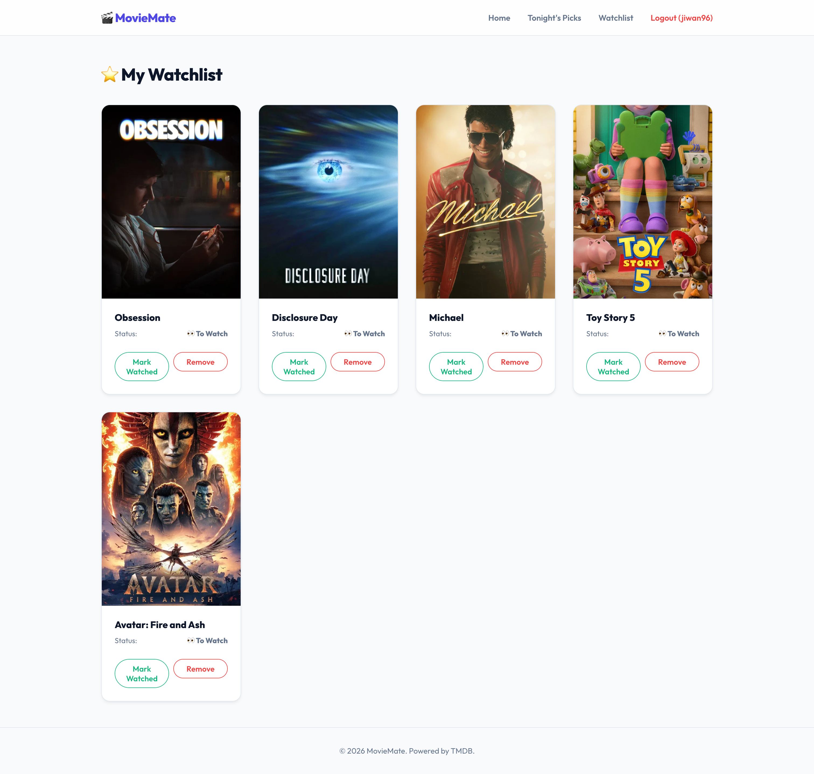

# 🎬 MovieMate

MovieMate is a premium, modern Django-based web application designed to be the ultimate cinematic companion. Powered by the TMDB API and securely backed by MongoDB, it provides a visually stunning experience for discovering movies, tracking watch history, and sharing your cinematic journey.

## ✨ Project Evolution & Premium Upgrades

MovieMate has been heavily upgraded to offer a **"SaaS VIP"** aesthetic. The entire platform features a Dark Space Theme with Glassmorphism, golden/emerald neon accents, and smooth micro-animations.

### 🌟 New Major Features

- **Movie Roulette**: Can't decide what to watch? Spin the slot machine! The Roulette randomly selects a movie from your unwatched Watchlist (or trending movies if your list is empty) with thrilling CSS animations.
- **MovieMate Wrapped (Dashboard)**: A dedicated dashboard that calculates your total watch time, highest-rated genres, and movie count. It includes a beautiful "Year in Review" card format.
- **Movie Diary Timeline**: A personalized journal view. As you rate and review movies, they are displayed in a gorgeous, vertical zig-zag timeline sorted chronologically.
- **Theater Mode**: No more tiny embedded trailers! Click "Watch Trailer", and the site dims into a full-screen, cinematic overlay with ambient lighting behind the video player.
- **Instagram Ticket Generator**: With a click of a button, generate a sleek, personalized digital "Movie Ticket" (complete with a fake barcode and perforated edges). It automatically downloads as a 9:16 PNG image perfectly sized for sharing on Instagram Stories!
- **Upcoming Calendar**: A dedicated calendar page showing upcoming movie releases so you never miss a blockbuster.

---

## UI Showcase

### 🏠 Homepage


### 🎰 Movie Roulette


### 📅 Coming Soon



### 🎬 Movie Overview (Detail & Ticket)


### 📊 Dashboard (Wrapped)


### ⭐ My Watchlist



---

## 🛠 Tech Stack

- **Backend:** Python 3, Django 5.1
- **Database:**
  - **SQLite:** For robust User Authentication & Sessions.
  - **MongoDB:** (via `pymongo`) For fast, flexible Watchlist document storage and Diary entries.
- **API:** TMDB (The Movie Database) API
- **Frontend:** HTML5, Vanilla JavaScript (`fetch` API, `html2canvas`), Custom Premium CSS (Glassmorphism, CSS Animations, no external CSS frameworks).

---

## ⚙️ Getting Started

### 1. Clone the repository

```bash
git clone <repository-url>
cd moviemate_prj
```

### 2. Set up virtual environment and install dependencies

```bash
python -m venv .venv
source .venv/bin/activate  # Mac/Linux
# .venv\Scripts\activate   # Windows

pip install -r requirements.txt
```

### 3. Set Environment Variables (.env)

Create a `.env` file in the root directory of the project and provide the following variables:

```env
SECRET_KEY=your_django_secret_key
TMDB_API_KEY=your_tmdb_api_key
```

> [!NOTE]
> You can obtain a TMDB API key by signing up on the [official TMDB website](https://www.themoviedb.org/).

### 4. Run MongoDB

Ensure MongoDB is installed locally and running on `mongodb://localhost:27017/`.
The application will automatically create and use a database named `moviemate_db`.

### 5. Run the Server

```bash
python manage.py migrate  # Creates auth tables in SQLite
python manage.py runserver
```

Navigate to `http://127.0.0.1:8000/` in your web browser.

---

## 📂 Project Structure

- `moviemate_prj/`: Main Django project configuration folder
- `accounts/`: App handling User Authentication (Login, Register, Logout)
- `movies/`: Core Django App handling all VIP features (Dashboard, Diary, Ticket Generation, Trending, Searching) and MongoDB integration.
